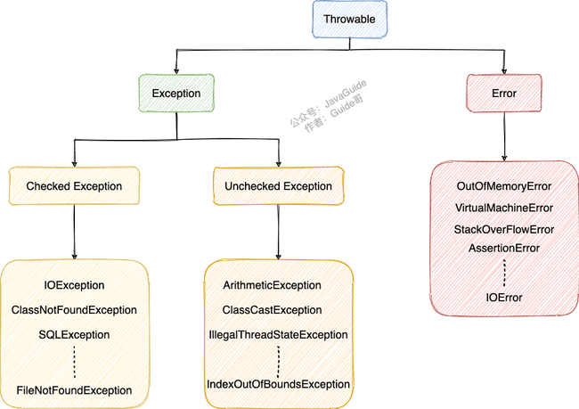

## 基础概念与常识

### Java 语言特点？

1. 面向对象（封装，继承，多态）；
2. 平台无关性（ Java 虚拟机实现平台无关性）；
3. 支持多线程（ C++ 语言没有内置的多线程机制，因此必须调用操作系统的多线程功能来进行多线程程序设计，而 Java 语言却提供了多线程支持）；
4. 可靠性；安全性；
5. 支持**网络编程**并且很方便（ Java 语言诞生本身就是为简化网络编程设计的，因此 Java 语言不仅支持网络编程而且很方便）；
6. 编译与解释并存；

> **🐛 修正（参见： [issue#544](https://github.com/Snailclimb/JavaGuide/issues/544)）** ：C++11 开始（2011 年的时候）,C++就引入了多线程库，在 windows、linux、macos 都可以使用`std::thread`和`std::async`来创建线程。参考链接：http://www.cplusplus.com/reference/thread/thread/?kw=thread

实际上，跨平台已经不是 Java 最大的卖点了，各种 JDK 新特性也不是。目前市面上虚拟化技术已经非常成熟，比如你**通过 Docker 就很容易实现跨平台了**。在我看来，Java 强大的生态才是！

### JVM vs JDK vs JRE


- 运行安装 JRE
- 编程安装 JDK

> 但是，这不是绝对的。有时，即使您不打算在计算机上进行任何 Java 开发，仍然需要安装 JDK。例如，如果要使用 JSP 部署 Web 应用程序，那么从技术上讲，您只是在应用程序服务器中运行 Java 程序。那你为什么需要 JDK 呢？因为应用程序服务器会将 JSP 转换为 Java servlet，并且需要使用 JDK 来编译 servlet。

#### JVM

Java 虚拟机（JVM）是**运行 Java 字节码**的虚拟机。

- JVM 针对不同系统（Windows，Linux，macOS）有特定实现
- **使用相同的字节码，它们都会给出相同的结果**。字节码和不同系统的 JVM 实现是 Java 语言“一次编译，随处可以运行”的关键所在。
- **只要满足 JVM 规范，每个公司、组织或者个人都可以开发自己的专属 JVM。** 平时接触到的 HotSpot VM 仅仅是是 JVM 规范的一种实现而已。

> 除了我们平时最常用的 HotSpot VM 外，还有 J9 VM、Zing VM、JRockit VM 等 JVM 。维基百科上就有常见 JVM 的对比：[Comparison of Java virtual machines](https://en.wikipedia.org/wiki/Comparison_of_Java_virtual_machines) 

####  JRE

JRE 是 **Java 运行时环境**。它是运行已编译 Java 程序所需的所有内容的集合，**包括 Java 虚拟机（JVM），Java 类库，java 命令和其他的一些基础构件**。但是，它不能用于创建新程序。

#### JDK

JDK 是 **Java Development Kit** 缩写，它是功能齐全的 Java SDK。它拥有 JRE 所拥有的一切，还有编译器（javac）和工具（如 javadoc 和 jdb）。它能够创建和编译程序。

### 什么是字节码?采用字节码的好处是什么?

在 Java 中，**JVM 可以理解的代码就叫做字节码**（即扩展名为 `.class` 的文件），它不面向任何特定的处理器，只面向虚拟机。

1. 一定程度上解决了**传统解释型语言执行效率低**的问题，同时又保留了**解释型语言可移植**的特点。所以， **Java 程序运行时相对来说还是高效**的（不过，和 C++，Rust，Go 等语言还是有一定差距的），
2. 由于字节码并不针对一种特定的机器，因此，Java 程序**无须重新编译便可在多种不同操作系统的计算机上运行**。

**Java 程序从源代码到运行的过程如下图所示：**


### JAVA中堆与栈

 **Java把内存划分成两种：一种是栈内存，一种是堆内存**。

JVM是基于堆栈的虚拟机，堆和栈都是Java用来在内存中存放数据的地方。

#### 功能和作用：

**堆主要用来存放对象的，栈主要是用来执行程序的。**

（1）栈，方法的运行模型，通过栈帧来调用，**JVM会为每个线程都分配一个栈区**，JVM对栈只进行两种操作：以帧为单位的**压栈和出栈操作**。当线程进入一个Java方法函数的时候，就会在当前线程的栈里压入一个栈帧，用于保存当前线程的状态（参数、局部变量、中间计算过程和其他数据），当退出函数方法时，修改栈指针就可以把栈中的内容销毁。

（2）堆，唯一的目的就是用于**存放对象实例**，每个Java应用都唯一对应一个JVM实例，每个JVM实例都唯一对应一个堆，并由堆内存被应用所有的线程共享。

#### 程序运行时的内存分配的三种策略：**静态的,栈式的,和堆式的**

**（1）静态存储分配**：编译时能知道所有变量的存储要求，分配固定的内存空间。

代码中**不允许有可变数据结构**，**不允许有嵌套或者递归**

**（2）栈式存储分配**：也可称为**动态存储分配**，**过程的入口处**必须知道所有的存储要求

由一个类似于堆栈的运行栈实现。进入程序模块时，必须知道数据区大小。按照**先进后出的原则**分配。

**（3）堆式存储分配**：**可变长度串和对象实例**

无法确定存储要求的内存分配**。**堆由大片的可利用块或空闲块组成，内存按照任意顺序分配和释放。

#### 性能与存储要求：

（1）**栈的性能比堆要快**，仅次于位于CPU中的寄存器。但是，在分配内存的时候，存放在栈中的数据大小与生存周期必须在编译时是确定的，**缺乏灵活性**。

（2）**堆可以动态分配内存大小**，编译器不必知道要从堆里分配多少存储空间，生存周期也不必事先告诉编译器，Java的垃圾收集器会自动收走这些不再使用的数据，因此可以得到**更大的灵活性**。但是，由于要在运行时动态分配内存和销毁对象时都需要占用时间，所以**效率低**。由于面向对象的多态性，堆内存分配是必不可少的，因为多态变量所需的存储空间只有在运行时创建了对象之后才能确定。当然，为达到这种灵活性，必然会付出一定的代价。

#### 内存的分配与回收：

跟C/C++不同，Java中分配**堆栈内存是由JVM自动分配和管理的。**

**Java中的数据类型有两种**：一种是8个基本类型（即int, short, long, byte, float, double, boolean, char），一种是引用类型。

（1）**栈内存中分配：基本类型、对象的引用**。当在一段代码块中定义一个变量时，由于这些变量大小可知，生存期可知，出于追求速度的原因，Java就在栈中为这个变量分配内存空间，当超过变量的作用域后，Java会自动释放掉为该变量所分配的内存空间。

（2）**引用类型**：Java中**所有对象的存储空间都是在堆中分配的，但是这个对象的引用却是在堆栈中分配。**栈中分配指向堆对象的引用。在堆中分配的内存，由Java虚拟机的自动垃圾回收器来管理。

#### 内存共享：

（1）栈数据的内存共享：

字面值的引用：编译器处理时

1. 在栈中创建一个变量的引用
   - 查找有没有字面值为3的地址
   - 如果已经有了，则直接将a指向这个地址。
2. a值的改变不会影响到b的值。

类对象的引用：假定两个类对象的引用同时指向一个对象，如果一个对象引用变量修改了这个对象的内部状态，那么另一个对象引用变量也即刻反映出这个变化。

（2）引用类型的内存共享：

**对象是类的实例，全部通过new()的形式来创建**。

一般String类中字符串值都是直接存值的。中没有存放该值的地址，便开辟了这个地址，并创建了一个新的对象，其字符串的值指向这个地址。

事实上，String类被设计成为不可改变(immutable)的类。如果你要改变其值，可以，但JVM在运行时根据新值悄悄创建了一个新对象，然后将这个对象的地址返回给原来类的引用。这个创建过程虽说是完全自动进行的，但它毕竟占用了更多的时间。在对时间要求比较敏感的环境中，会带有一定的不良影响。 只要是用new()来新建对象的，都会在堆中创建，而且其字符串是单独存值的，即使与栈中的数据相同，也不会与栈中的数据共享。

综上：

（1）我们在使用诸如 String str = "abc" 的格式定义类时，对象可能并没有被创建。唯一可以肯定的是，指向 String类的引用被创建了，至于这个引用到底是否指向了一个新的对象，必须根据上下文来考虑，除非通过new()方法来显式地创建一个新的对象。

（2）使用 String str = "abc" 的方式，可以在一定程度上提高程序的运行速度，因为JVM会自动根据栈中数据的实际情况来决定是否有必要创建新对象，这是享元模式的思想。而对于String str = new String("abc")；的代码，则一概在堆中创建新对象，而不管其字符串值是否相等，是否有必要创建新对象，从而加重了程序的负担。
————————————————

[]: 原文链接：https://blog.csdn.net/a745233700/article/details/89228381


### Java 和 C++ 的区别?

Java 和 C++ **都是面向对象的语言**，都**支持封装、继承和多态**

不相同的地方：

- Java **不提供指针来直接访问内存**，程序内存更加安全
- Java 的类是单继承的，C++ 支持多重继承；虽然 **Java 的类不可以多继承，但是接口可以多继承**。
- Java 有**自动内存管理垃圾回收机制**(GC)，不需要程序员手动释放无用内存。
- C ++同时支持方法重载和操作符重载，但是 **Java 只支持方法重载**（操作符重载增加了复杂性，这与 Java 最初的设计思想不符）。

#### 静态方法为什么不能调用非静态成员?

这个需要结合 JVM 的相关知识，主要原因如下：

1. **静态方法是属于类的**，在类加载的时候就会分配内存，可以通过类名直接访问。而**非静态成员属于实例对象**，只有在对象实例化之后才存在，需要通过类的实例对象去访问。
2. 在类的非静态成员不存在的时候静态成员就已经存在了，此时调用在内存中还不存在的非静态成员，属于非法操作。

#### 静态方法和实例方法有何不同？

**1、调用方式**

在外部调用静态方法时，可以使用 `类名.方法名` 的方式，也可以使用 `对象.方法名` 的方式，而实例方法只有后面这种方式。也就是说，**调用静态方法可以无需创建对象** 。

> 一般建议使用 `类名.方法名` 的方式来调用静态方法。
>
> 一般不建议使用 `对象.方法名` 的方式来调用静态方法。这种方式非常容易造成混淆，静态方法不属于类的某个对象而是属于这个类。

**2、访问类成员是否存在限制**

**静态方法**在访问本类的成员时，**只允许访问静态成员（即静态成员变量和静态方法）**，不允许访问实例成员（即实例成员变量和实例方法），而实例方法不存在这个限制。

#### 重载和重写的区别

> 重载就是同样的一个方法能够根据输入数据的不同，做出不同的处理
>
> 重写就是当子类继承自父类的相同方法，输入数据一样，但要做出有别于父类的响应时，你就要覆盖父类方法

**重载**

发生在同一个类中（或者父类和子类之间），方法名必须相同，**参数类型不同、个数不同、顺序不同，方法返回值和访问修饰符可以不同**。

**重写**

重写发生在运行期，是子类对父类的允许访问的方法的实现过程进行重新编写。

1. 方法名、参数列表必须相同，子类方法**返回值类型应比父类方法返回值类型更小或相等**，抛出的异常范围小于等于父类，**访问修饰符范围大于等于父**类。
2. 如果父类方法访问修饰符为 `private/final/static` 则子类就不能重写该方法，但是被 `static` 修饰的方法能够被再次声明。
3. 构造方法无法被重写

**方法的重写要遵循“两同两小一大”**（以下内容摘录自《疯狂 Java 讲义》，[issue#892](https://github.com/Snailclimb/JavaGuide/issues/892) ）：

- “两同”即**方法名相同、形参列表**相同；
- “两小”指的是子类方法**返回值类型应比父类方法返回值类型更小或相等**，子类方法声明抛出的**异常类应比父类方法声明抛出的异常类更小或相等**；
- “一大”指的是子类方法的**访问权限应比父类方法的访问权限更大或相等。**

### 可变长参数？

允许在调用方法时传入不定长度的参数。方法就可以接受 0 个或者多个参数。

1. 另外，可变参数**只能作为函数的最后一个参数**，但其前面可以有也可以没有任何其他参数。
2. **方法重载先匹配固定参数的方法**，因为固定参数的方法匹配度更高。

```java
public static void method2(String arg1, String... args) {
   //......
}
```

## 基本数据类型

### Java 中的几种基本数据类型了解么？

Java 中有 8 种基本数据类型，分别为：

- 6 种数字类型：
  - 4 种整数型：`byte`、`short`、`int`、`long`
  - 2 种浮点型：`float`、`double`
- 1 种字符类型：`char`
- 1 种布尔型：`boolean`。

这 8 种基本数据类型的默认值以及所占空间的大小如下：

| 基本类型  | 位数 | 字节 | 默认值  | 取值范围                                   |
| :-------- | :--- | :--- | :------ | ------------------------------------------ |
| `byte`    | 8    | 1    | 0       | -128 ~ 127                                 |
| `short`   | 16   | 2    | 0       | -32768 ~ 32767                             |
| `int`     | 32   | 4    | 0       | -2147483648 ~ 2147483647                   |
| `long`    | 64   | 8    | 0L      | -9223372036854775808 ~ 9223372036854775807 |
| `char`    | 16   | 2    | 'u0000' | 0 ~ 65535                                  |
| `float`   | 32   | 4    | 0f      | 1.4E-45 ~ 3.4028235E38                     |
| `double`  | 64   | 8    | 0d      | 4.9E-324 ~ 1.7976931348623157E308          |
| `boolean` | 1    |      | false   | true、false                                |

对于 `boolean`，官方文档未明确定义，它依赖于 JVM 厂商的具体实现。逻辑上理解是占用 1 位，但是实际中会考虑计算机高效存储因素。

另外，Java 的每种**基本类型所占存储空间的大小**不会像其他大多数语言那样随机器硬件架构的变化而变化。这种所占存储空间大小的不变性是 Java 程序比用其他大多数语言编写的程序更具可移植性的原因之一（《Java 编程思想》2.2 节有提到）。

**注意：**

1. Java 里使用 `long` 类型的数据一定要在数值后面加上 **L**，否则将作为整型解析。
2. `char a = 'h'`char :单引号，`String a = "hello"` :双引号。

这八种基本类型对应的包装类分别为：`Byte`、`Short`、`Integer`、`Long`、`Float`、`Double`、`Character`、`Boolean` 。

### 基本类型和包装类型的区别？

- **包装类型不赋值就是 `null`** ，而基本类型有默认值且不是 `null`。
- **包装类型可用于泛型**，而基本类型不可以。
- 基本数据类型的局部变量存放在 Java 虚拟机栈中的局部变量表中，基本数据类型的成员变量（未被 `static` 修饰 ）存放在 Java 虚拟机的堆中。**包装类型属于对象类型**，我们知道**几乎所有对象实例都存在于堆中。**
- 相比于对象类型， **基本数据类型占用的空间非常小**。

### 包装类型的常量池技术了解么？

Java 基本类型的包装类的大部分都实现了常量池技术。

- `Byte`,`Short`,`Integer`,`Long` 这 4 种包装类默认创建了数值 **[-128，127]** 的**相应类型的缓存数据**，`Character` 创建了数值在 **[0,127]** 范围的缓存数据，`Boolean` 直接返回 `True` or `False`。
- 有缓存返回IntegerCache.cache，没有就返回new Integer()
- 超出对应范围仍然会去创建新的对象，缓存的范围区间的大小只是在性能和资源之间的权衡。


两种**浮点数类型的包装类 `Float`,`Double` 并没有实现常量池技术**。

**所有整型包装类对象之间值的比较，全部使用 equals 方法比较**。

### 自动装箱与拆箱了解吗？原理是什么？

**什么是自动拆装箱？**

- **装箱**：将基本类型用它们对应的引用类型包装起来；
- **拆箱**：将包装类型转换为基本数据类型；

装箱其实就是调用了 包装类的`valueOf()`方法，拆箱其实就是调用了 `xxxValue()`方法。

- `Integer i = 10` 等价于 `Integer i = Integer.valueOf(10)`
- `int n = i` 等价于 `int n = i.intValue()`;

**频繁拆装箱的话，会严重影响系统的性能。应避免不必要的拆装箱操作。**


## 面向对象基础

### 面向对象和面向过程的区别

两者的主要区别在于解决问题的方式不同：

- 面向过程把解决问题的**过程拆成一个个方法**，通过一个个方法的执行解决问题。
- 面向对象会先**抽象出对象，然后用对象执行方法**的方式解决问题。

另外，**面向对象开发的程序一般更易维护、易复用、易扩展。**

### 成员变量与局部变量的区别有哪些？

- **语法形式** ：

  成员变量：访问控制修饰符 `public`,`private`，及 `static` 所修饰

  成员变量和局部变量都能被 `final` 所修饰。 

- **存储方式** ：对象存在于堆内存，局部变量则存在于栈内存。

  使用 `static` 属于类，**对象存在于堆内存**

  没有使用 `static` 属于实例**，局部变量存在于栈内存**。

- **生存时间** ：成员变量随对象，局部变量随方法。

- **默认值** ：

  **成员变量如果没有被赋初始值，则会自动以类型的默认值而赋值**（一种情况例外:被 `final` 修饰的成员变量也必须显式地赋值），而**局部变量则不会自动赋值。**

### 值传递&引用传递

程序设计语言将实参传递给方法（或函数）的方式分为两种：

- **值传递** ：方法接收的是实参值的拷贝，会创建副本。
- **引用传递** ：方法接收的直接是实参所引用的对象在堆中的地址，不会创建副本，对形参的修改将影响到实参。

### 为什么 Java 只有值传递？

很多程序设计语言（比如 C++、 Pascal )提供了两种参数传递的方式

**Java 中只有值传递，传递值值是实参的地址**！

也就是说 `change` 方法的参数拷贝的是  `arr` （实参）的地址，因此，它和 `arr` 指向的是同一个数组对象。这也就说明了为什么方法内部对形参的修改会影响到实参。

Java 中将实参传递给方法（或函数）的方式是 **值传递** ：

- 如果参数是基本类型的话，很简单，传递的就是基本类型的字面量值的拷贝，会创建副本。
- 如果参数是引用类型，传递的就是**实参所引用的对象在堆中地址值的拷贝**，同样也会创建副本。

### 创建一个对象用什么运算符?对象实体与对象引用有何不同?

new 运算符，new 创建对象实例（对象实例在堆内存中），对象引用指向对象实例（对象引用存放在栈内存中）。

一个对象引用可以指向 0 个或 1 个对象；一个对象可以有 n 个引用指向它。

### 对象的相等与指向他们的引用相等,两者有什么不同?

- 对象的相等一般比较的是内存中**存放的内容**是否相等。
- 引用相等一般比较的是他们指向的**内存地址**是否相等。

### 一个类的构造方法的作用是什么?

构造方法是一种特殊的方法，主要作用是**完成对象的初始化工作**。

### 如果一个类没有声明构造方法，该程序能正确执行吗?

可以。

Java 添加默认的无参数的构造方法。如果重载构造方法（无论是否有参）就不再添加。

### 构造方法有哪些特点？是否可被 override?

构造方法特点如下：

- 名字与类名相同。
- 没有返回值，但不能用 void 声明构造函数。
- 生成类的对象时自动执行，无需调用。

构造方法不能被 override（重写）,但是可以 overload（重载），一个类可以有多个构造函数。

### 面向对象三大特征

#### 封装

指把一个对象的状态信息（也就是属性）隐藏在对象内部，不允许外部对象直接访问对象的内部信息。但是可以提供一些可以被外界访问的方法来操作属性。

#### 继承

使用已存在的类的定义作为基础建立新类，新类可以增加新的数据或新的功能，可以用父类的功能，但不**能选择性地继承父类**。

通过使用继承，可以快速地创建新的类，可以提高代码的重用，程序的可维护性，节省大量创建新类的时间 ，提高我们的开发效率。

**关于继承如下 3 点请记住：**

1. 子类拥有父类对象所有的属性和方法（包括私有属性和私有方法），但是父类中的**私有属性和方法**子类是无法访问，**只是拥有**。
2. 子类可以拥有自己属性和方法，即子类可以对父类进行扩展。
3. 子类可以override父类的方法。

#### 多态

多态，顾名思义，表示一个对象具有多种的状态，具体表现为父类的引用指向子类的实例。

**多态的特点:**

- 对象类型和引用类型之间具有继承（类）/实现（接口）的关系；
- 引用类型变量发出的方法调用的到底是哪个类中的方法，必须在程序运行期间才能确定；
- 多态不能调用“只在子类存在但在父类不存在”的方法；
- 如果子类重写了父类的方法，真正执行的是子类覆盖的方法，如果子类没有覆盖父类的方法，执行的是父类的方法。

### 接口和抽象类有什么共同点和区别？

**共同点** ：

- 都不能被实例化。
- 都可以包含抽象方法。
- 都可以有默认实现的方法（Java 8 可以用 `default` 关键在接口中定义默认方法）。

**区别** ：

- 接口主要用于对类的行为进行约束，你实现了某个接口就具有了对应的行为。抽象类主要用于代码复用，强调的是所属关系（比如说我们抽象了一个发送短信的抽象类，）。
- 一个类只能继承一个类，但是可以实现多个接口。
- 接口中的成员变量只能是 `public static final` 类型的，不能被修改且必须有初始值，而抽象类的成员变量默认 default，可在子类中被重新定义，也可被重新赋值。

### 深拷贝和浅拷贝区别了解吗？什么是引用拷贝？

- **浅拷贝**：浅拷贝会在堆上创建一个新的对象（区别于引用拷贝的一点），不过，如果原对象内部的**属性是引用类型**的话，浅拷贝会**直接复制内部对象的引用地址**，也就是说**拷贝对象和原对象共用同一个内部对象**。
- **深拷贝** ：深拷贝会完全复制整个对象，包括这个对象所包含的内部对象。
- 引用拷贝：两个不同的引用指向同一个对象。


## Java 常见对象

### Object

#### Object 类的常见方法有哪些？

Object 类是一个特殊的类，是所有类的父类。它主要提供了以下 11 个方法：

```java
/**
 * native 方法，用于返回当前运行时对象的 Class 对象，使用了 final 关键字修饰，故不允许子类重写。
 */
public final native Class<?> getClass()
/**
 * native 方法，用于返回对象的哈希码，主要使用在哈希表中，比如 JDK 中的HashMap。
 */
public native int hashCode()
/**
 * 用于比较 2 个对象的内存地址是否相等，String 类对该方法进行了重写以用于比较字符串的值是否相等。
 */
public boolean equals(Object obj)
/**
 * naitive 方法，用于创建并返回当前对象的一份拷贝。
 */
protected native Object clone() throws CloneNotSupportedException
/**
 * 返回类的名字实例的哈希码的 16 进制的字符串。建议 Object 所有的子类都重写这个方法。
 */
public String toString()
/**
 * native 方法，并且不能重写。唤醒一个在此对象监视器上等待的线程(监视器相当于就是锁的概念)。如果有多个线程在等待只会任意唤醒一个。
 */
public final native void notify()
/**
 * native 方法，并且不能重写。跟 notify 一样，唯一的区别就是会唤醒在此对象监视器上等待的所有线程，而不是一个线程。
 */
public final native void notifyAll()
/**
 * native方法，并且不能重写。暂停线程的执行。注意：sleep 方法没有释放锁，而 wait 方法释放了锁 ，timeout 是等待时间。
 */
public final native void wait(long timeout) throws InterruptedException
/**
 * 多了 nanos 参数，这个参数表示额外时间（以毫微秒为单位，范围是 0-999999）。 所以超时的时间还需要加上 nanos 毫秒。。
 */
public final void wait(long timeout, int nanos) throws InterruptedException
/**
 * 跟之前的2个wait方法一样，只不过该方法一直等待，没有超时时间这个概念
 */
public final void wait() throws InterruptedException
/**
 * 实例被垃圾回收器回收的时候触发的操作
 */
protected void finalize() throws Throwable { }
```

#### == 和 equals() 的区别

**`==`** 对于基本类型和引用类型的作用效果是不同的：

- 对于基本数据类型来说，`==` 比较的是值。
- 对于引用数据类型来说，`==` 比较的是对象的内存地址。

> 因为 Java 只有值传递，所以，对于 == 来说，不管是比较基本数据类型，还是引用数据类型的变量，其本质比较的都是值，只是引用类型变量存的值是对象的地址。

**`equals()`** **不能用于判断基本数据类型的变量**，只能用来**判断两个对象是否相等**。`equals()`方法存在于`Object`类中，而`Object`类是所有类的直接或间接父类，因此所有的类都有`equals()`方法。

`equals()` 方法存在两种使用情况：

- **类没有重写 `equals()`方法** ：通过`equals()`比较该类的两个对象时，等价于通过“==”比较这两个对象，使用的默认是 `Object`类`equals()`方法。

- **类重写了 `equals()`方法** ：一般我们都重写 `equals()`方法来比较两个对象中的属性是否相等；若它们的属性相等，则返回 true(即，认为这两个对象相等)。

  **`String` 中的 `equals` 方法是被重写过的**，因为 `Object` 的 `equals` 方法是比较的对象的内存地址，而 `String` 的 `equals` 方法比较的是对象的值。

  当创建 `String` 类型的对象时，虚拟机会在常量池中查找有没有已经存在的值和要创建的值相同的对象，如果有就把它赋给当前引用。如果没有就在常量池中重新创建一个 `String` 对象。

#### hashCode() 有什么用？

`hashCode()` 的作用是获取哈希码（`int` 整数），也称为散列码，作用是**确定该对象在哈希表中的索引位置。**

`hashCode()`定义在 JDK 的 `Object` 类中，这就意味着 Java 中的任何类都包含有 `hashCode()` 函数。另外需要注意的是： `Object` 的 `hashCode()` 方法是本地方法，也就是用 C 语言或 C++ 实现的，该方法通常用来将对象的内存地址转换为整数之后返回。

```java
public native int hashCode();
```

**散列表存储的是键值对(key-value)**，它的特点是：**能根据“键”快速的检索出对应的“值”。这其中就利用到了散列码！（可以快速找到所需要的对象）**

#### 为什么要有 hashCode？

我们以“`HashSet` 如何检查重复”为例子来说明为什么要有 `hashCode`？

下面这段内容摘自《Head First Java》:

> 当你把对象加入 `HashSet` 时，`HashSet` 会先计算对象的 `hashCode` 值来判断对象加入的位置，同时也会与其他已经加入的对象的 `hashCode` 值作比较，如果没有相符的 `hashCode`，`HashSet` 会假设对象没有重复出现。但是如果发现有相同 `hashCode` 值的对象，这时会调用 `equals()` 方法来检查 `hashCode` 相等的对象是否真的相同。如果两者相同，`HashSet` 就不会让其加入操作成功。如果不同的话，就会重新散列到其他位置。这样我们就大大减少了 `equals` 的次数，相应就大大提高了执行速度。

其实， `hashCode()` 和 `equals()`都是用于比较两个对象是否相等。

为什么 JDK 还要同时提供这两个方法呢？**

这是因为在一些容器（比如 `HashMap`、`HashSet`）中，有了 `hashCode()` 之后，判断元素是否在对应容器中的效率会更高（参考添加元素进`HashSet`的过程）！

我们在前面也提到了添加元素进`HashSet`的过程，如果 `HashSet` 在对比的时候，同样的 `hashCode` 有多个对象，它会继续使用 `equals()` 来判断是否真的相同。也就是说 `hashCode` 帮助我们大大缩小了查找成本。

**那为什么不只提供 `hashCode()` 方法呢？**

这是因为两个对象的`hashCode` 值相等并不代表两个对象就相等。

**那为什么两个对象有相同的 `hashCode` 值，它们也不一定是相等的？**

因为 `hashCode()` 所使用的哈希算法也许刚好会让多个对象传回相同的哈希值。越糟糕的哈希算法越容易碰撞，但这也与数据值域分布的特性有关（所谓哈希碰撞也就是指的是不同的对象得到相同的 `hashCode` )。

总结下来就是 ：

- 如果两个对象的`hashCode` 值相等，那这两个对象不一定相等（哈希碰撞）。
- 如果两个对象的`hashCode` 值相等并且`equals()`方法也返回 `true`，我们才认为这两个对象相等。
- 如果两个对象的`hashCode` 值不相等，我们就可以直接认为这两个对象不相等。

#### 为什么重写 equals() 时必须重写 hashCode() 方法？

因为两个相等的对象的 `hashCode` 值必须是相等。也就是说如果 `equals` 方法判断两个对象是相等的，那这两个对象的 `hashCode` 值也要相等。

如果重写 `equals()` 时没有重写 `hashCode()` 方法的话就可能会导致 `equals` 方法判断是相等的两个对象，`hashCode` 值却不相等。

**思考** ：重写 `equals()` 时没有重写 `hashCode()` 方法的话，使用 `HashMap` 可能会出现什么问题。

**总结** ：

- `equals` 方法判断两个对象是相等的，那这两个对象的 `hashCode` 值也要相等。
- 两个对象有相同的 `hashCode` 值，他们也不一定是相等的（哈希碰撞）。

### String

都使用字符数组保存字符串， Java 9 之后，改用 `byte` 数组存储字符串。

`StringBuilder` 与 `StringBuffer` 都继承自 `AbstractStringBuilder` 类，定义了一些字符串的基本操作，如 `expandCapacity`、`append`、`insert`、`indexOf` 等公共方法。

#### String、StringBuffer、StringBuilder 的区别？

**可变性**

`String` 不可变。

`StringBuilder` 与 `StringBuffer` 可变，没有使用 `final` 和 `private` 关键字修饰字符数组。

**线程安全性**

`String` 不可变的，为常量，线程安全。

`StringBuffer` 对方法**加了同步锁**或者对调用的方法加了同步锁，所以是线程安全的。

`StringBuilder` 并没有对方法进行加同步锁，所以是非线程安全的。

**性能**

每次对 `String` 类型进行改变的时候，都会生成一个新的 `String` 对象，然后将指针指向新的 `String` 对象。

`StringBuffer` 和 `StringBuilder` 都会对对象本身进行操作。 `StringBuffer` 仅能获得 10%~15% 左右的性能提升，但却要冒多线程不安全的风险。

**对于三者使用的总结：**

1. 操作**少量的数据**: 适用 `String`
2. **单线程**操作字符串缓冲区下操作**大量**数据: 适用 `StringBuilder`
3. **多线程**操作字符串缓冲区下操作**大量**数据: 适用 `StringBuffer`

#### String 为什么是不可变的?

1. 保存字符串的数组被 `final` 修饰且为私有的，并且`String` 类没有提供/暴露修改这个字符串的方法。
2. `String` 类被 `final` 修饰导致其不能被继承，进而避免了子类破坏 `String` 不可变。

#### **Java 9 为何要将 `String` 的底层实现由 `char[]` 改成了 `byte[]` ?**

新版的 String 其实**支持两个编码方案： Latin-1 和 UTF-16**。如果字符串中包含的汉字没有超过 Latin-1 可表示范围内的字符，那就会使用 Latin-1 作为编码方案。Latin-1 编码方案下，`byte` 占一个字节(8 位)，`char` 占用 2 个字节（16），`byte` 相较 `char` 节省一半的内存空间。

#### 字符串拼接用“+” 还是 StringBuilder?

Java 语言本身并不支持运算符重载，“+”和“+=”是专门为 String 类重载过的运算符，也是 Java 中仅有的两个重载过的元素符。

对象引用和“+”的字符串拼接方式，实际上是通过 `StringBuilder` 调用 `append()` 方法实现的，拼接完成之后调用 `toString()` 得到一个 `String` 对象 。

不过，在循环内使用“+”进行字符串的拼接的话，存在比较明显的缺陷：**编译器不会创建单个 `StringBuilder` 以复用，会导致创建过多的 `StringBuilder` 对象**。

#### String#equals() 和 Object#equals() 有何区别？

`String` 中的 `equals` 方法是被重写过的，比较的是 String 字符串的值是否相等。 `Object` 的 `equals` 方法是比较的对象的内存地址。

#### 字符串常量池的作用了解吗？

**字符串常量池** 是 JVM 为了**提升性能和减少内存消耗**针对字符串（String 类）专门开辟的一块区域，主要目的是为了**避免字符串的重复创建**。

**只要使用 new 的方式创建对象，便需要创建新的对象** ：

1. 在堆中创建一个字符串对象
2. 检查字符串常量池中是否有和 new 的字符串值相等的字符串常量
3. 如果没有的话需要在字符串常量池中也创建一个值相等的字符串常量，如果有的话，就直接返回堆中的字符串实例对象地址。

**字符串常量池比较特殊，它的主要使用方法有两种：**

1. 直接使用双引号声明出来的 `String` 对象会直接存储在常量池中。
2. 如果不是用双引号声明的 `String` 对象，使用 `String` 提供的 `intern()` 方法也有同样的效果。

#### String s1 = new String("abc");这句话创建了几个字符串对象？

会创建 1 或 2 个字符串：

- 如果字符串常量池中已存在字符串常量“abc”，则只会在堆空间创建一个字符串常量“abc”。
- 如果字符串常量池中没有字符串常量“abc”，那么它将首先在字符串常量池中创建，然后在堆空间中创建，因此将创建总共 2 个字符串对象。

#### String 类型的变量和常量做“+”运算时发生了什么？

对象引用和“+”的字符串拼接方式，实际上是通过 `StringBuilder` 调用 `append()` 方法实现的，拼接完成之后调用 `toString()` 得到一个 `String` 对象 。

```java
String str4 = new StringBuilder().append(str1).append(str2).toString();
```

多个字符串对象拼接，会重新创建对象。

**总结** ：

1. 对于基本数据类型来说，==比较的是值。对于引用数据类型来说，==比较的是对象的内存地址。
2. 在编译过程中，Javac 编译器（下文中统称为编译器）会进行一个叫做 **常量折叠(Constant Folding)** 的代码优化。常量折叠会把常量表达式的值求出来作为常量嵌在最终生成的代码中，这是 Javac 编译器会对源代码做的极少量优化措施之一(代码优化几乎都在即时编译器中进行)。
3. 一般来说，我们要尽量避免通过 new 的方式创建字符串。使用双引号声明的 `String` 对象（ `String s1 = "java"` ）更利于让编译器有机会优化我们的代码，同时也更易于阅读。
4. 被 `final` 关键字修改之后的 `String` 会被编译器当做常量来处理，编译器程序编译期就可以确定它的值，其效果就相当于访问常量。

## 泛型

#### Java 泛型了解么？什么是类型擦除？介绍一下常用的通配符？

**Java 泛型（generics）** 是 JDK 5 中引入的一个新特性, 泛型提供了编译时类型安全检测机制，该机制允许程序员在编译时检测到非法的类型。泛型的**本质是参数化类型**，也就是说**所操作的数据类型被指定为一个参数。**

Java 的泛型是伪泛型，这是因为 **Java 在运行期间，所有的泛型信息都会被擦掉**，这也就是通常所说类型擦除 。

#### 泛型使用方法

一般有三种使用方式: 泛型类、泛型接口、泛型方法。

**1.泛型类**：

```java
//此处T可以随便写为任意标识，常见的如T、E、K、V等形式的参数常用于表示泛型
//在实例化泛型类时，必须指定T的具体类型
public class Generic<T> {
    private T key;
    public Generic(T key) {
        this.key = key;
    }
    public T getKey() {
        return key;
    }
}
```

如何实例化泛型类：

```java
Generic<Integer> genericInteger = new Generic<Integer>(123456);
```

**2.泛型接口** ：

```java
public interface Generator<T> {
    public T method();
}
```

实现泛型接口，不指定类型：

```java
class GeneratorImpl<T> implements Generator<T>{
    @Override
    public T method() {
        return null;
    }
}
```

实现泛型接口，指定类型：

```java
class GeneratorImpl implements Generator<String>{
    @Override
    public String method() {
        return "hello";
    }
}
```

**3.泛型方法** ：

```java
public static <E> void printArray(E[] inputArray) {
    for (E element : inputArray) {
        System.out.printf("%s ", element);
    }
    System.out.println();
}
```

使用：

```java
// 创建不同类型数组： Integer, Double 和 Character
Integer[] intArray = { 1, 2, 3 };
String[] stringArray = { "Hello", "World" };
printArray(intArray);
printArray(stringArray);
```

#### 常用的通配符有哪些？

**常用的通配符为： T，E，K，V，？**

- ？ 表示不确定的 Java 类型
- T (type) 表示具体的一个 Java 类型
- K V (key value) 分别代表 Java 键值中的 Key Value
- E (element) 代表 Element

#### 你的项目中哪里用到了泛型？

- 可用于定义通用返回结果 `CommonResult<T>` 通过参数 `T` 可根据具体的返回类型动态指定结果的数据类型
- 定义 `Excel` 处理类 `ExcelUtil<T>` 用于动态指定 `Excel` 导出的数据类型
- 用于构建集合工具类。参考 `Collections` 中的 `sort`, `binarySearch` 方法
- ......

## 反射

JVM为每个加载的`class`及`interface`创建了对应的`Class`实例来保存`class`及`interface`的所有信息；

获取一个`class`对应的`Class`实例后，就可以获取该`class`的所有信息；

通过Class实例获取`class`信息的方法称为反射（Reflection）；

JVM总是动态加载`class`，可以在运行期根据条件来控制加载class。

### 何为反射？

反射是为了解决在运行期，对某个实例一无所知的情况下，如何调用其方法。

反射之所以被称为框架的灵魂，主要是因为它赋予了我们在运行时分析类以及执行类中方法的能力。

**通过反射你可以获取任意一个类的所有属性和方法，你还可以调用这些方法和属性。**

### 反射机制优缺点

- **优点** ： 可以让咱们的代码更加灵活、为各种框架提供开箱即用的功能提供了便利
- **缺点** ：让我们在运行时有了分析操作类的能力，这同样也增加了安全问题。比如**可以无视泛型参数的安全检查**（泛型参数的安全检查发生在**编译时**）。另外，反射的性能也要稍差点，不过，对于框架来说实际是影响不大的。[Java Reflection: Why is it so slow?](https://stackoverflow.com/questions/1392351/java-reflection-why-is-it-so-slow)

### 反射的应用场景

像咱们平时大部分时候都是在写业务代码，很少会接触到直接使用反射机制的场景。

但是，这并不代表反射没有用。相反，正是因为反射，你才能这么轻松地使用各种框架。像 Spring/Spring Boot、MyBatis 等等框架中都大量使用了反射机制。

**这些框架中也大量使用了动态代理，而动态代理的实现也依赖反射。**

### 使用方法

#### 如何获取一个`class`的`Class`实例？

有三个方法：

方法一：直接通过一个`class`的静态变量`class`获取：

```
Class cls = String.class;
```

方法二：如果我们有一个实例变量，可以通过该实例变量提供的`getClass()`方法获取：

```
String s = "Hello";
Class cls = s.getClass();
```

方法三：如果知道一个`class`的完整类名，可以通过静态方法`Class.forName()`获取：

```
Class cls = Class.forName("java.lang.String");
```

因为`Class`实例在JVM中是唯一的，所以，上述方法获取的`Class`实例是同一个实例。可以用`==`比较两个`Class`实例：

```
Class cls1 = String.class;

String s = "Hello";
Class cls2 = s.getClass();

boolean sameClass = cls1 == cls2; // true
```

##### `Class`实例比较和`instanceof`的差别：

用`instanceof`不但匹配指定类型，还匹配指定类型的子类。而用`==`判断`class`实例可以精确地判断数据类型，但不能作子类型比较。

通常情况下，我们应该用`instanceof`判断数据类型，因为面向抽象编程的时候，我们不关心具体的子类型。只有在需要精确判断一个类型是不是某个`class`的时候，我们才使用`==`判断`class`实例。

#### 获取字段信息

`Class`类提供了以下几个方法来获取字段：

- Field getField(name)：根据字段名获取某个public的field（包括父类）
- Field getDeclaredField(name)：根据字段名获取当前类的某个field（不包括父类）
- Field[] getFields()：获取所有public的field（包括父类）
- Field[] getDeclaredFields()：获取当前类的所有field（不包括父类）

一个`Field`对象包含了一个字段的所有信息：

- `getName()`：返回字段名称，例如，`"name"`；
- `getType()`：返回字段类型，也是一个`Class`实例，例如，`String.class`；
- `getModifiers()`：返回字段的修饰符，它是一个`int`，不同的bit表示不同的含义。

调用`Field.setAccessible(true)`的意思是，别管这个字段是不是`public`，一律允许访问。

此外，`setAccessible(true)`可能会失败。如果JVM运行期存在`SecurityManager`，那么它会根据规则进行检查，有可能阻止`setAccessible(true)`。例如，某个`SecurityManager`可能不允许对`java`和`javax`开头的`package`的类调用`setAccessible(true)`，这样可以保证JVM核心库的安全。

##### 设置字段值

通过Field实例可以读取或设置某个对象的字段，如果存在访问限制，要首先调用`setAccessible(true)`来访问非`public`字段。

设置字段值是通过`Field.set(Object, Object)`实现的，其中第一个`Object`参数是指定的实例，第二个`Object`参数是待修改的值。示例代码如下：

```
Class c = p.getClass();
Field f = c.getDeclaredField("name");
f.setAccessible(true);
f.set(p, "Xiao Hong");
```

#### 调用方法

`Class`类提供了以下几个方法来获取`Method`：

- `Method getMethod(name, Class...)`：获取某个`public`的`Method`（包括父类）
- `Method getDeclaredMethod(name, Class...)`：获取当前类的某个`Method`（不包括父类）
- `Method[] getMethods()`：获取所有`public`的`Method`（包括父类）
- `Method[] getDeclaredMethods()`：获取当前类的所有`Method`（不包括父类）

一个`Method`对象包含一个方法的所有信息：

- `getName()`：返回方法名称，例如：`"getScore"`；
- `getReturnType()`：返回方法返回值类型，也是一个Class实例，例如：`String.class`；
- `getParameterTypes()`：返回方法的参数类型，是一个Class数组，例如：`{String.class, int.class}`；
- `getModifiers()`：返回方法的修饰符，它是一个`int`，不同的bit表示不同的含义。

调用

对`Method`实例调用`invoke`就相当于调用该方法，`invoke`的第一个参数是对象实例，即在哪个实例上调用该方法，后面的可变参数要与方法参数一致，否则将报错。通过反射调用方法时，仍然遵循多态原则。

```
// 获取String substring(int)方法，参数为int:
Method m = String.class.getMethod("substring", int.class);
// 在s对象上调用该方法并获取结果:
String r = (String) m.invoke(s, 6);
```

调用静态方法

如果获取到的Method表示一个静态方法，调用静态方法时，由于无需指定实例对象，所以`invoke`方法传入的第一个参数永远为`null`。

调用非public方法

和Field类似，对于非public方法，我们虽然可以通过`Class.getDeclaredMethod()`获取该方法实例，但直接对其调用将得到一个`IllegalAccessException`。为了调用非public方法，我们通过`Method.setAccessible(true)`允许其调用：

调用构造方法

- `Constructor`对象封装了构造方法的所有信息；
- 通过`Class`实例的方法可以获取`Constructor`实例：`getConstructor()`，`getConstructors()`，`getDeclaredConstructor()`，`getDeclaredConstructors()`；
- 通过`Constructor`实例可以创建一个实例对象：`newInstance(Object... parameters)`，（`cons2.newInstance("456");`）； 通过设置`setAccessible(true)`来访问非`public`构造方法。

#### 获取父类的Class

通过`Class`对象可以获取继承关系：

- `Class getSuperclass()`：获取父类类型；
- `Class[] getInterfaces()`：获取当前类实现的所有接口。

通过`Class`对象的`isAssignableFrom()`方法可以判断一个向上转型是否可以实现。

#### 动态代理

Java标准库提供了动态代理功能，允许在运行期动态创建一个接口的实例；

动态代理是通过`Proxy`创建代理对象，然后将接口方法“代理”给`InvocationHandler`完成的。

在运行期动态创建一个`interface`实例的方法如下：

1. 定义一个`InvocationHandler`实例，它负责实现接口的方法调用；
2. 通过`Proxy.newProxyInstance()`创建interface实例，它需要3个参数：
   1. 使用的`ClassLoader`，通常就是接口类的`ClassLoader`；
   2. 需要实现的接口数组，至少需要传入一个接口进去；
   3. 用来处理接口方法调用的`InvocationHandler`实例。
3. 将返回的`Object`强制转型为接口。

## 注解

`Annotation` （注解）是放在Java源码的类、方法、字段、参数前的一种特殊“注释”

注解本质是一个继承了`Annotation` 的特殊接口，只有被解析之后才会生效，常见的解析方法有两种：

- **编译期直接扫描** ：编译器在编译 Java 代码的时候扫描对应的注解并处理，比如某个方法使用`@Override` 注解，编译器在编译的时候就会检测当前的方法是否重写了父类对应的方法。
- **运行期通过反射处理** ：像框架中自带的注解(比如 Spring 框架的 `@Value` 、`@Component`)都是通过反射来进行处理的。

JDK 提供了很多内置的注解（比如 `@Override` 、`@Deprecated`），同时，我们还可以自定义注解。

Java的注解可以分为三类：

第一类是由编译器使用的注解，例如：

- `@Override`：让编译器检查该方法是否正确地实现了覆写；
- `@SuppressWarnings`：告诉编译器忽略此处代码产生的警告。

这类注解不会被编译进入`.class`文件，它们在编译后就被编译器扔掉了。

第二类是由工具处理`.class`文件使用的注解，比如有些工具会在加载class的时候，对class做动态修改，实现一些特殊的功能。这类注解会被编译进入`.class`文件，但加载结束后并不会存在于内存中。这类注解只被一些底层库使用，一般我们不必自己处理。

第三类是在程序运行期能够读取的注解，它们在加载后一直存在于JVM中，这也是最常用的注解。例如，一个配置了`@PostConstruct`的方法会在调用构造方法后自动被调用（这是Java代码读取该注解实现的功能，JVM并不会识别该注解）。

注解如何使用，完全由程序自己决定。例如，JUnit是一个测试框架，它会自动运行所有标记为`@Test`的方法。

可以在运行期通过反射读取`RUNTIME`类型的注解，注意千万不要漏写`@Retention(RetentionPolicy.RUNTIME)`，否则运行期无法读取到该注解。

## 异常

**Java 异常类层次结构图概览** ：



### Exception 和 Error 有什么区别？

在 Java 中，所有的异常都有一个共同的祖先 `java.lang` 包中的 `Throwable` 类。`Throwable` 类有两个重要的子类:

- **`Exception`** :**程序本身可以处理的异常**，可以通过 `catch` 来进行捕获。`Exception` 又可以分为 Checked Exception (受检查异常，必须处理) 和 Unchecked Exception (不受检查异常，可以不处理)。
- **`Error`** ：**程序无法处理的错误** ，~~我们没办法通过 `catch` 来进行捕获~~不建议通过`catch`捕获 。例如Java 虚拟机运行错误（`Virtual MachineError`）、虚拟机内存不够错误(`OutOfMemoryError`)、类定义错误（`NoClassDefFoundError`）等 。这些**异常发生时，Java 虚拟机（JVM）一般会选择线程终止。**

### Checked Exception 和 Unchecked Exception 有什么区别？

1. **Checked Exception** 即受检查异常，Java 代码在编译过程中，如果受检查异常没有被 `catch`/`throw` 处理的话，就**没办法通过编译** 。

   除了`RuntimeException`及其子类以外，其他的`Exception`类及其子类都属于受检查异常 。常见的受检查异常有： IO 相关的异常、`ClassNotFoundException` 、`SQLException`...。

2. **Unchecked Exception** 即 **不受检查异常** ，Java 代码在编译过程中 ，我们即使不处理不受检查异常也可以正常通过编译。

   **`RuntimeException` 及其子类都统称为非受检查异常**，例如：`NullPointerException`、`NumberFormatException`（字符串转换为数字）、`ArrayIndexOutOfBoundsException`（数组越界）、`ClassCastException`（类型转换错误）、`ArithmeticException`（算术错误）等。

### Throwable 类常用方法有哪些？

- `String getMessage()`: 返回异常发生时的简要描述
- `String toString()`: 返回异常发生时的详细信息
- `String getLocalizedMessage()`: 返回异常对象的本地化信息。使用 `Throwable` 的子类覆盖这个方法，可以生成本地化信息。如果子类没有覆盖该方法，则该方法返回的信息与 `getMessage()`返回的结果相同
- `void printStackTrace()`: 在控制台上打印 `Throwable` 对象封装的异常信息

### try-catch-finally 如何使用？

- **`try`块：** 用于捕获异常。其后可接零个或多个 `catch` 块，如果没有 `catch` 块，则必须跟一个 `finally` 块。
- **`catch`块：** 用于处理 try 捕获到的异常。
- **`finally` 块：** 无论是否捕获或处理异常，`finally` 块里的语句都会被执行。当在 `try` 块或 `catch` 块中遇到 `return` 语句时，`finally` 语句块将在方法返回之前被执行。

**注意：不要在 finally 语句块中使用 return!**  当 try 语句和 finally 语句中都有 return 语句时，try 语句块中的 return 语句会被忽略。这是因为 try 语句中的 return 返回值会先被暂存在一个本地变量中，当执行到 finally 语句中的 return 之后，这个本地变量的值就变为了 finally 语句中的 return 返回值。

### finally 中的代码一定会执行吗？

不一定的！在某些情况下，finally 中的代码不会被执行。

就比如说 `finally` 之前虚拟机被终止运行的话，finally 中的代码就不会被执行。

另外，在以下 2 种特殊情况下，`finally` 块的代码也不会被执行：

1. 程序所在的线程死亡。
2. 关闭 CPU。

### 如何使用 `try-with-resources` 代替`try-catch-finally`？

1. **适用范围（资源的定义）：** 任何实现 `java.lang.AutoCloseable`或者 `java.io.Closeable` 的对象
2. **关闭资源和 finally 块的执行顺序：** 在 `try-with-resources` 语句中，任何 catch 或 finally 块在**声明的资源关闭后运行**

Java 中类似于`InputStream`、`OutputStream` 、`Scanner` 、`PrintWriter`等的资源都需要我们调用`close()`方法来手动关闭，然多个资源需要关闭的时候，使用 `try-with-resources` 实现起来也非常简单，如果你还是用`try-catch-finally`可能会带来很多问题。

通过使用分号分隔，可以在`try-with-resources`块中声明多个资源。

```
try (BufferedInputStream bin = new BufferedInputStream(new FileInputStream(new File("test.txt")));
             BufferedOutputStream bout = new BufferedOutputStream(new FileOutputStream(new File("out.txt")))) {
            //语句执行
        }
        catch (IOException e) {
            e.printStackTrace();
        }
```

## I/O

### 什么是序列化?什么是反序列化?

如果我们需要持久化 Java 对象比如**将 Java 对象保存在文件**中，或者在**网络传输 Java 对象**，这些场景都需要用到序列化。

简单来说：

- **序列化**： 将数据结构或对象转换成二进制字节流的过程
- **反序列化**：将在序列化过程中所生成的二进制字节流转换成数据结构或者对象的过程

**序列化的主要目的是通过网络传输对象或者说是将对象存储到文件系统、数据库、内存中。**


### Java 序列化中如果有些字段不想进行序列化，怎么办？

使用 `transient` 关键字修饰，注意：

- `transient` **只能修饰变量**，不能修饰类和方法。
- `transient` 修饰的变量，在反序列化后变量值将会被置成类型的默认值。
- `static` 变量因为不属于任何对象(Object)，所以无论有没有 `transient` 关键字修饰，均不会被序列化。

### 实际开发中有哪些用到序列化和反序列化的场景？

1. 对象在进行**网络传输**（比如远程方法调用RPC的时候）
2. 将**对象存储到文件中**
3. 将**对象存储到缓存数据库**（如 Redis）

### 序列化协议对应于TCP/IP 4层模型的哪一层？

表示层对应用层的用户数据进行处理转换为二进制流。

因为，**OSI七层协议模型中的应用层、表示层和会话层对应的都是TCP/IP 四层模型中的应用层**，所以**序列化协议属于TCP/IP协议应用层的一部分。**


#### 常见序列化协议对比

**JDK自带的序列化方式一般不会用 ，因为序列化效率低并且部分版本有安全漏洞**。

比较**常用的序列化协议有 hessian、kyro、protostuff。**

> JSON 和 XML这种属于文本类序列化方式。 **可读性比较好，但是性能较差，一般不会选择。**

##### JDK自带的序列化方式

实现 `java.io.Serializable`接口。很少或几乎不用，原因：

1. **不支持跨语言调用** : 如果调用的是其他语言开发的服务的时候就不支持了。
2. **性能差** ：相比于其他序列化框架性能更低，主要原因是序列化之后的**字节数组体积较大，导致传输成本加大**。

### 获取用键盘输入常用的两种方法

方法 1：通过 `Scanner`

```java
Scanner input = new Scanner(System.in);
String s  = input.nextLine();
input.close();
```

方法 2：通过 `BufferedReader`

```java
BufferedReader input = new BufferedReader(new InputStreamReader(System.in));
String s = input.readLine();
```

### Java 中 IO 流分为几种?

- 按照流的流向分，可以分为**输入流和输出流**；
- 按照操作单元划分，可以划分为**字节流和字符流**；
- 按照流的角色划分为**节点流和处理流**。

40 多个类都是从如下 **4 个抽象类基类**中派生出来的。

- InputStream/Reader: 所有的输入流的基类，**前者是字节输入流，后者是字符输入流。**
- OutputStream/Writer: 所有输出流的基类，**前者是字节输出流，后者是字符输出流。**

按操作方式分类结构图：


按操作对象分类结构图：


### 既然有了字节流,为什么还要有字符流?

问题本质想问：**不管是文件读写还是网络发送接收，信息的最小存储单元都是字节，那为什么 I/O 流操作要分为字节流操作和字符流操作呢？**

回答：字符流是由 Java 虚拟机将字节转换得到的，问题就出在这个过程还算是**非常耗时**，并且，如果我们**不知道编码类型就很容易出现乱码问题**。所以， I/O 流就干脆提供了一个直接操作字符的接口，方便我们平时对字符进行流操作。如**果音频文件、图片等媒体文件用字节流比较好，如果涉及到字符的话使用字符流比较好。**

- 
