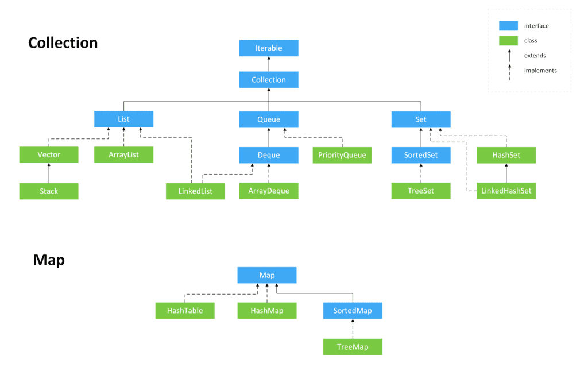

# Java
## scanner输入
```
import java.util.Scanner;

public class Main {
    public static void main(String[] args) {
        Scanner scanner = new Scanner(System.in); // 创建Scanner对象
        System.out.print("Input your name: "); // 打印提示
        String name = scanner.nextLine(); // 读取一行输入并获取字符串
        System.out.print("Input your age: "); // 打印提示
        int age = scanner.nextInt(); // 读取一行输入并获取整数
        System.out.printf("Hi, %s, you are %d\n", name, age);
         // 格式化输出
    }
}
```
1. import导入java.util.Scanner
2. 创建Scanner对象并传入System.in。
` Scanner scanner = new Scanner(System.in);`
System.out代表标准输出流，而System.in代表标准输入流。
3. 读取用户输入的字符串，使用scanner.nextLine()，
读取输入的整数，scanner.nextInt()。Scanner会自动转换数据类型，因此不必手动转换。

## 数组操作
**数组变量初始化**必须使用new int[5]表示创建一个可容纳5个int元素的数组。
或直接赋值：<br>
`int[] ns = new int[] { 68, 79, 91, 85, 62 };`或<br>
`int[] ns = { 68, 79, 91, 85, 62 };`<br>

### 数组类型转换

#### int[]

```
int[] example1 = list.stream().mapToInt(i->i).toArray();
// OR
int[] example2 = list.stream().mapToInt(Integer::intValue).toArray();
//输入直接转换
int[] nums= Arrays.stream(inp.nextLine().split(","))
            .map(Integer::parseInt).mapToInt(Integer::intValue).toArray();
```

#### Integer[]

```
Integer[] input= Arrays.stream(inp.nextLine().split("\\s+"))
          .map(Integer::parseInt).toArray(Integer[]::new);
```

#### List\<Integer>

```
List<Integer> numms= Arrays.stream(in.nextLine().split(","))
                    .map(Integer::parseInt).collect(Collectors.toList());
```

#### List\<String>

```
List<String> ids= Arrays.stream(inp.nextLine().split(","))
                .collect(Collectors.toList());
```

#### List类型顺便排序：

```
List<String> ids= Arrays.stream(inp.nextLine().split(",")).sorted((Comparator<String>) (o1 , o2) -> {
            int o1len = o1.length(), o2len = o2.length();
            int temp1, temp2;
            for (int i = 0; i < o1.length() + o2.length(); i++) {
                if (i >= o1len) {
                    temp1 = o2.charAt(i - o1len);
                } else temp1 = o1.charAt(i);
                if (i >= o2len) {
                    temp2 = o1.charAt(i - o2len);
                } else temp2 = o2.charAt(i);
                if (temp1 == temp2) continue;
                return temp2 - temp1;
            }
            return 0;
        }).collect(Collectors.toList());
```

#### 数组内容合格检测

```
boolean err=Arrays.stream(str.split(""))//string分成单个字符的string[]
                .allMatch(
                istr -> (istr.compareTo("A") >= 0 && istr.compareTo("Z") <= 0)
                        || ((istr.compareTo("z") <= 0) && (istr.compareTo("a") >= 0)));
```

### 数组复制

#### 使用Arrays.copyOf[Range函数]

`int[] arr = Arrays.copyOf(sourceArray, sourceArray.length);`<br>
Java的数组有几个特点：

1. 数组所有元素初始化为默认值，整型都是0，浮点型是0.0，布尔型是false；
2. 数组一旦创建后，**大小就不可改变**。
3. 要访问数组中的某一个元素，需要使用索引。数组索引从0开始，例如，5个元素的数组，索引范围是0~4。
4. 可以修改数组中的某一个元素，使用赋值语句，例如，ns[1] = 79;。
5. 可以用数组变量.length获取数组大小：  
6. **数组是引用类型**，在使用索引访问数组元素时，如果索引超出范围，运行时将报错：

#### 使用subList

```java
import java.util.ArrayList;

public class hello {
    public static void main(String[] args) {
        // create an empty array list
        ArrayList<String> color_list = new ArrayList<String>();

        // use add() method to add values in the list
        color_list.add("White");
        color_list.add("Black");
        color_list.add("Red");

        //Return portion of the list : fromindex(inclusive)->1,  toindex(exclusive)->3
        ArrayList<String> new_color_list1 = new ArrayList<String>(color_list.subList(1, 3));
    }
}

```


### 遍历数组

- `for (int i=0; i<ns.length; i++)`
- `for (int n : ns)`
- `System.out.println(Arrays.toString(ns));`
### 排序
常用的排序算法有冒泡排序、插入排序和快速排序等。
1. 基本的排序算法：冒泡排序（Bubble Sort）、插入排序（Insertion Sort）
2. **常考**的排序算法: **归并排序（Merge Sort）、快速排序（Quick Sort）、拓扑排序（Topological Sort）**
3. 其他排序算法：堆排序（Heap Sort）、桶排序（Bucket Sort)


#### 基本
冒泡排序（Bubble Sort）、插入排序（Insertion Sort）
##### 冒泡排序
```public static void main(String[] args) {
        int[] ns = { 28, 12, 89, 73, 65, 18, 96, 50, 8, 36 };
        // 排序前:
        System.out.println(Arrays.toString(ns));
        for (int i = 0; i < ns.length - 1; i++) {
            for (int j = 0; j < ns.length - i - 1; j++) {
                if (ns[j] > ns[j+1]) {
                    // 交换ns[j]和ns[j+1]:
                    int tmp = ns[j];
                    ns[j] = ns[j+1];
                    ns[j+1] = tmp;
                }
            }
        }
        // 排序后:
        System.out.println(Arrays.toString(ns));
    }
```
##### 插入排序
插入排序是一种最简单直观的排序算法，它的**工作原理**是通过构建有序序列，对于未排序数据，在已排序序列中从后向前扫描，找到相应位置并插入。

插入排序和冒泡排序一样，也有一种优化算法，叫做拆半插入。
```
public class InsertSort implements IArraySort {

    @Override
    public int[] sort(int[] sourceArray) throws Exception {
        // 对 arr 进行拷贝，不改变参数内容
        int[] arr = Arrays.copyOf(sourceArray, sourceArray.length);

        // 从下标为1的元素开始选择合适的位置插入，因为下标为0的只有一个元素，默认是有序的
        for (int i = 1; i < arr.length; i++) {

            // 记录要插入的数据
            int tmp = arr[i];

            // 从已经排序的序列最右边的开始比较，找到比其小的数
            int j = i;
            while (j > 0 && tmp < arr[j - 1]) {
                arr[j] = arr[j - 1];
                j--;
            }

            // 存在比其小的数，插入
            if (j != i) {
                arr[j] = tmp;
            }

        }
        return arr;
    }
}
```


**算法步骤**<br>
1. 将第一待排序序列第一个元素看做一个有序序列，把第二个元素到最后一个元素当成是未排序序列。
2. 从头到尾依次扫描未排序序列，将扫描到的每个元素插入有序序列的适当位置。（如果待插入的元素与有序序列中的某个元素相等，则将待插入元素插入到相等元素的后面。）

```
public class InsertSort implements IArraySort {

    @Override
    public int[] sort(int[] sourceArray) throws Exception {
        // 对 arr 进行拷贝，不改变参数内容
        int[] arr = Arrays.copyOf(sourceArray, sourceArray.length);

        // 从下标为1的元素开始选择合适的位置插入，因为下标为0的只有一个元素，默认是有序的
        for (int i = 1; i < arr.length; i++) {

            // 记录要插入的数据
            int tmp = arr[i];

            // 从已经排序的序列最右边的开始比较，找到比其小的数
            int j = i;
            while (j > 0 && tmp < arr[j - 1]) {
                arr[j] = arr[j - 1];
                j--;
            }

            // 存在比其小的数，插入
            if (j != i) {
                arr[j] = tmp;
            }

        }
        return arr;
    }
}
```

#### 常考
归并排序（Merge Sort）、快速排序（Quick Sort）、拓扑排序（Topological Sort）
##### 归并排序
归并排序（Merge sort）是建立在归并操作上的一种有效的排序算法。该算法是采用分治法（Divide and Conquer）的一个非常典型的应用。<br>
作为一种典型的分而治之思想的算法应用，归并排序的实现由两种方法：
1. 自上而下的递归（所有递归的方法都可以用迭代重写，所以就有了第 2 种方法）；
2. 自下而上的迭代；

**步骤**

1. 申请空间，使其大小为两个已经排序序列之和，该空间用来存放合并后的序列；
2. 设定两个指针，最初位置分别为两个已经排序序列的起始位置；
3. 比较两个指针所指向的元素，选择相对小的元素放入到合并空间，并移动指针到下一位置；
4. 重复步骤 3 直到某一指针达到序列尾；
5. 将另一序列剩下的所有元素直接复制到合并序列尾。

```
public class MergeSort implements IArraySort {

    @Override
    public int[] sort(int[] sourceArray) throws Exception {
        // 对 arr 进行拷贝，不改变参数内容
        int[] arr = Arrays.copyOf(sourceArray, sourceArray.length);

        if (arr.length < 2) {
            return arr;
        }
        int middle = (int) Math.floor(arr.length / 2);

        int[] left = Arrays.copyOfRange(arr, 0, middle);
        int[] right = Arrays.copyOfRange(arr, middle, arr.length);

        return merge(sort(left), sort(right));
    }

    protected int[] merge(int[] left, int[] right) {
        int[] result = new int[left.length + right.length];
        int i = 0;
        //result[i++]=result[i++]*2 等价于
        //result[i]=result[i+1]*2;i++;i++;
        while (left.length > 0 && right.length > 0) {
            if (left[0] <= right[0]) {
                result[i++] = left[0];
                left = Arrays.copyOfRange(left, 1, left.length);
            } else {
                result[i++] = right[0];
                right = Arrays.copyOfRange(right, 1, right.length);
            }
        }

        while (left.length > 0) {
            result[i++] = left[0];
            left = Arrays.copyOfRange(left, 1, left.length);
        }

        while (right.length > 0) {
            result[i++] = right[0];
            right = Arrays.copyOfRange(right, 1, right.length);
        }

        return result;
    }

}
```

##### 快速排序


```
public class QuickSort implements IArraySort {

    @Override
    public int[] sort(int[] sourceArray) throws Exception {
        // 对 arr 进行拷贝，不改变参数内容
        int[] arr = Arrays.copyOf(sourceArray, sourceArray.length);

        return quickSort(arr, 0, arr.length - 1);
    }

    private int[] quickSort(int[] arr, int left, int right) {
        if (left < right) {
            int partitionIndex = partition(arr, left, right);
            quickSort(arr, left, partitionIndex - 1);
            quickSort(arr, partitionIndex + 1, right);
        }
        return arr;
    }

    private int partition(int[] arr, int left, int right) {
        // 设定基准值（pivot）
        int pivot = left;
        int index = pivot + 1;
        for (int i = index; i <= right; i++) {
            if (arr[i] < arr[pivot]) {
                swap(arr, i, index);
                index++;
            }
        }
        swap(arr, pivot, index - 1);
        return index - 1;
    }

    private void swap(int[] arr, int i, int j) {
        int temp = arr[i];
        arr[i] = arr[j];
        arr[j] = temp;
    }

}
```
##### 拓扑排序
Topological sort 又称 Topological order，这个名字有点迷惑性，因为拓扑排序并不是一个纯粹的排序算法，它只是针对某一类图，找到一个可以执行的线性顺序。<br>
Directed acyclic graph (DAG)，有向无环图。即：
+ 这个图的边必须是有方向的；
+ 图内无环。

**特性**
1. 如果这个图不是 DAG，那么它是没有拓扑序的；
2. 如果是 DAG，那么它至少有一个拓扑序；
3. 反之，如果它存在一个拓扑序，那么这个图必定是 DGA.
<br>所以这是一个充分必要条件。<br>
**时间复杂度**
注意⚠️：对于图的时间复杂度分析一定是两个参数，面试的时候很多同学张口就是 O(n)...

**对于有 v 个顶点和 e 条边的图来说**，
- 第一步，预处理得到 map 或者 array，需要过一遍所有的边才行，所以是 O(e)；
- 第二步，把 入度 == 0 的点入队出队的操作是 O(v)，如果是一个 DAG，那所有的点都需要入队出队一次；
- 第三步，每次执行一个顶点的时候，要把它指向的那条边消除了，这个总共执行 e 次；

**总：O(v + e)**

**空间复杂度**

用了一个数组来存所有点的 indegree，之后的 queue 也是最多把所有的点放进去，所以是 **O(v)**.

```
class Solution {
    public int[] findOrder(int numCourses, int[][] prerequisites) {
        int[] res = new int[numCourses];
        int[] indegree = new int[numCourses];

        // get the indegree for each course
        for(int[] pre : prerequisites) {
            indegree[pre[0]] ++;
        }

        // put courses with indegree == 0 to queue
        Queue<Integer> queue = new ArrayDeque<>();
        for(int i = 0; i < numCourses; i++) {
            if(indegree[i] == 0) {
                queue.offer(i);
            }
        }

        // execute the course
        int i = 0;
        while(!queue.isEmpty()) {
            Integer curr = queue.poll();
            res[i++] = curr;

            // remove the pre = curr
            for(int[] pre : prerequisites) {
                if(pre[1] == curr) {
                    indegree[pre[0]] --;
                    if(indegree[pre[0]] == 0) {
                        queue.offer(pre[0]);
                    }
                }
            }
        }

        return i == numCourses ? res : new int[]{};
    }
}
```
#### 其他
##### 堆排序
堆排序（Heapsort）是指利用堆这种数据结构所设计的一种排序算法。堆积是一个近似完全二叉树的结构，并同时满足堆积的性质：即子结点的键值或索引总是小于（或者大于）它的父节点。堆排序可以说是一种利用堆的概念来排序的选择排序。分为两种方法：

大顶堆：每个节点的值都大于或等于其子节点的值，在堆排序算法中用于升序排列；
小顶堆：每个节点的值都小于或等于其子节点的值，在堆排序算法中用于降序排列；
堆排序的平均时间复杂度为 Ο(nlogn)。

1. 算法步骤
创建一个堆 H[0……n-1]；

把堆首（最大值）和堆尾互换；

把堆的尺寸缩小 1，并调用 shift_down(0)，目的是把新的数组顶端数据调整到相应位置；

重复步骤 2，直到堆的尺寸为 1。

```
public class HeapSort implements IArraySort {

    @Override
    public int[] sort(int[] sourceArray) throws Exception {
        // 对 arr 进行拷贝，不改变参数内容
        int[] arr = Arrays.copyOf(sourceArray, sourceArray.length);

        int len = arr.length;

        buildMaxHeap(arr, len);

        for (int i = len - 1; i > 0; i--) {
            swap(arr, 0, i);
            len--;
            heapify(arr, 0, len);
        }
        return arr;
    }

    private void buildMaxHeap(int[] arr, int len) {
        for (int i = (int) Math.floor(len / 2); i >= 0; i--) {
            heapify(arr, i, len);
        }
    }

    private void heapify(int[] arr, int i, int len) {
        int left = 2 * i + 1;
        int right = 2 * i + 2;
        int largest = i;

        if (left < len && arr[left] > arr[largest]) {
            largest = left;
        }

        if (right < len && arr[right] > arr[largest]) {
            largest = right;
        }

        if (largest != i) {
            swap(arr, i, largest);
            heapify(arr, largest, len);
        }
    }

    private void swap(int[] arr, int i, int j) {
        int temp = arr[i];
        arr[i] = arr[j];
        arr[j] = temp;
    }

}
```

##### 桶排序
桶排序是计数排序的升级版。它利用了函数的映射关系，高效与否的关键就在于这个映射函数的确定。为了使桶排序更加高效，我们需要做到这两点：
* 在额外空间充足的情况下，尽量增大桶的数量
* 使用的映射函数能够将输入的 N 个数据均匀的分配到 K 个桶中
<br>同时，对于桶中元素的排序，选择何种比较排序算法对于性能的影响至关重要。<br>

1. 什么时候最快
当输入的数据可以均匀的分配到每一个桶中。

2. 什么时候最慢
当输入的数据被分配到了同一个桶中。

3. 示意图
元素分布在桶中：

```
public class BucketSort implements IArraySort {

    private static final InsertSort insertSort = new InsertSort();

    @Override
    public int[] sort(int[] sourceArray) throws Exception {
        // 对 arr 进行拷贝，不改变参数内容
        int[] arr = Arrays.copyOf(sourceArray, sourceArray.length);

        return bucketSort(arr, 5);
    }

    private int[] bucketSort(int[] arr, int bucketSize) throws Exception {
        if (arr.length == 0) {
            return arr;
        }

        int minValue = arr[0];
        int maxValue = arr[0];
        for (int value : arr) {
            if (value < minValue) {
                minValue = value;
            } else if (value > maxValue) {
                maxValue = value;
            }
        }

        int bucketCount = (int) Math.floor((maxValue - minValue) / bucketSize) + 1;
        int[][] buckets = new int[bucketCount][0];

        // 利用映射函数将数据分配到各个桶中
        for (int i = 0; i < arr.length; i++) {
            int index = (int) Math.floor((arr[i] - minValue) / bucketSize);
            buckets[index] = arrAppend(buckets[index], arr[i]);
        }

        int arrIndex = 0;
        for (int[] bucket : buckets) {
            if (bucket.length <= 0) {
                continue;
            }
            // 对每个桶进行排序，这里使用了插入排序
            bucket = insertSort.sort(bucket);
            for (int value : bucket) {
                arr[arrIndex++] = value;
            }
        }

        return arr;
    }

    /**
     * 自动扩容，并保存数据
     *
     * @param arr
     * @param value
     */
    private int[] arrAppend(int[] arr, int value) {
        arr = Arrays.copyOf(arr, arr.length + 1);
        arr[arr.length - 1] = value;
        return arr;
    }

}
```

## Java Collection类
Collection是最基本的集合接口，一个Collection代表一组Object，即Collection的元素（Elements）。Java SDK不提供直接继承自Collection的类，Java SDK提供的类都是继承自Collection的“子接口”如List和Set。<br>
**语法**<br>
`public interface Collection<E> extends Iterable<E> {}`
它是一个接口，是高度抽象出来的集合，它包含了集合的基本操作：<br>
**添加、删除、清空、遍历(读取)、是否为空、获取大小、是否保护某元素**等等。<br>
**方法**<br>

```
boolean add(E e) 
    确保此 collection 包含指定的元素（可选操作）。 
boolean addAll(Collection c) 
    将指定 collection 中的所有元素都添加到此 collection 中（可选操作）。 
void clear() 
    移除此 collection 中的所有元素（可选操作）。 
boolean contains(Object o) 
    如果此 collection 包含指定的元素，则返回 true。 
boolean containsAll(Collection c) 
    如果此 collection 包含指定 collection 中的所有元素，则返回 true。 
boolean equals(Object o) 
    比较此 collection 与指定对象是否相等。 
int hashCode() 
    返回此 collection 的哈希码值。 
boolean isEmpty() 
    如果此 collection 不包含元素，则返回 true。 
Iteratoriterator() 
    返回在此 collection 的元素上进行迭代的迭代器。 
boolean remove(Object o) 
    从此 collection 中移除指定元素的单个实例，如果存在的话（可选操作）。 
boolean removeAll(Collection c) 
    移除此 collection 中那些也包含在指定 collection 中的所有元素（可选操作）。 
boolean retainAll(Collection c) 
    仅保留此 collection 中那些也包含在指定 collection 的元素（可选操作）。 
int size() 
    返回此 collection 中的元素数。 
Object[] toArray() 
    返回包含此 collection 中所有元素的数组。
T[] toArray(T[] a) 
    返回包含此 collection 中所有元素的数组；返回数组的运行时类型与指定数组的运行时类型相同。
```

**iterator接口**<br>
不论Collection的实际类型如何，它都支持一个iterator()的方法，该方法返回一个迭代子，使用该迭代子即可逐一访问Collection中每一个元素。iterator方法如下：
```
boolean	hasNext()
	如果仍有元素可以迭代，则返回 true。
E next()
	返回迭代的下一个元素。
void remove()
	从迭代器指向的集合中移除迭代器返回的最后一个元素（可选操作）。
Iterator实例

Iterator it = collection.iterator(); // 获得一个迭代子
while(it.hasNext()) {
	Object obj = it.next(); // 得到下一个元素
}
```

**继承体系**
### Collection层次结构
>
    |-----List  有序(存储顺序和取出顺序一致)，可重复
        |----ArrayList ，线程不安全，底层使用数组实现，查询快，增删慢，效率高。
        |----LinkedList ， 线程不安全，底层使用链表实现，查询慢，增删快，效率高。
        |----Vector ， 线程安全，底层使用数组实现，查询快，增删慢，效率低。每次容量不足时，默认自增长度的一倍（如果不指定增量的话），如下源码可知
    |-----Set   元素唯一一个不包含重复元素的 collection。更确切地讲，set 不包含满足 e1.equals(e2) 的元素对 e1 和 e2，并且最多包含一个 null 元素。
        |--HashSet 底层是由HashMap实现的，通过对象的hashCode方法与equals方法来保证插入元素的唯一性，无序(存储顺序和取出顺序不一致)，。
            |--LinkedHashSet 底层数据结构由哈希表和链表组成。哈希表保证元素的唯一性，链表保证元素有序。(存储和取出是一致)
        |--TreeSet 基于 TreeMap 的 NavigableSet 实现。使用元素的自然顺序对元素进行排序，或者根据创建 set 时提供的 Comparator 进行排序，具体取决于使用的构造方法。 元素唯一。


让我们看看Collection框架的层次结构。java。util包包含了集合框架的所有类和接口。<br>


Collection包含了List和Set两大分支：<br>
(1) List是一个有序的队列，每一个元素都有它的索引，第一个元素的索引值是0。List的实现类有LinkedList、ArrayList、Vector和Stack。
1. LinkedList实现了List接口，允许元素为空，LinkedList提供了额外的get,remove,insert方法，这些操作可以使LinkedList被用作堆栈、队列或双向队列。
<br>LinkedList并不是线程安全的，如果多个线程同时访问LinkedList，则必须自己实现访问同步，或者另外一种解决方法是在创建List时构造一个同步的List。
2. ArrayList  实现了可变大小的数组，允许所有元素包括null，同时ArrayList也不是线程安全的。
3. Vector类似于ArrayList，但Vector是线程安全的。
4. Stack继承自Vector，实现一个后进先出的堆栈。
<br>(2) set是一个不允许有重复元素的集合。set的实现类有Hashset和Treeset。HashSet依赖于HashMap，实际上是通过HashMap实现的；TreeSet依赖于TreeMap，通过TreeMap来实现的。

**总结**
1) 如果涉及到堆栈，队列等操作，应该考虑用List；对于需要快速插入，删除元素，应该使用LinkedList；如果需要快速随机访问元素，应该使用ArrayList。
2) 如果程序在单线程环境中，或者访问仅仅在一个线程中进行，考虑非同步的类，其效率较高；如果多个线程可能同时操作一个类，应该使用同步的类。
3) 要特别注意对哈希表的操作，作为key的对象要正确复写equals和hashCode方法。
4) 尽量返回接口而非实际的类型，如返回List而非ArrayList，这样如果以后需要将ArrayList换成LinkedList时，客户端代码不用改变。这就是针对抽象编程。

### 遍历
如何遍历Collection中的每一个元素？不论Collection的实际类型如何，它都支持一个iterator()的方法，该方法返回一个迭代子，使用该迭代子即可逐一访问Collection中每一个元素。典型的用法如下：

```
Iterator it = collection.iterator(); // 获得一个迭代子
while(it.hasNext()) {
    Object obj = it.next(); // 得到下一个元素
}
```
### 子数列

```
public static void main(String[] args) {
        int[] src = new int[]{1, 2, 3, 4, 5};
        int newArray[] = Arrays.copyOfRange(src, 0, 2);
        for (int i : newArray) {
            System.out.println(i);
        }
    }
————————————————
版权声明：本文为CSDN博主「淡竹云开」的原创文章，遵循CC 4.0 BY-SA版权协议，转载请附上原文出处链接及本声明。
原文链接：https://blog.csdn.net/zhangpeterx/article/details/88716563
```


## List 类

**继承体系**
>
|--List:元素是**有序**的(怎么存的就怎么取出来，顺序不会乱)，元素**可以重复**（角标1上有个3，角标2上也可以有个3）因为该集合体系**有索引**，
  |-- ArrayList：底层的数据结构使用的是**数组结构**（数组长度是可变的**百分之五十延长**）（特点是**查询很快**，但**增删较慢**）**线程不同步**
  |-- LinkedList：底层的数据结构是**链表结构**（特点是**查询较慢，增删较快**）
  |-- Vector：底层是**数组数据结构 线程同步**（数组长度是可变的**百分之百延长**）（无论查询还是增删都很慢，被ArrayList替代了）

**总结**
1. 所有的List中只能容纳单个不同类型的对象组成的表，而不是Key－Value键值对。例如：[ tom,1,c ]
2. 所有的List中可以有相同的元素，例如Vector中可以有 [ tom,koo,too,koo ]
3. 所有的List中可以有null元素，例如[ tom,null,1 ]
4. 基于Array的List（Vector，ArrayList）适合查询，而LinkedList 适合添加，删除操作

**定义**<br>
>void add(String item)  //依次往后添加添加元素
void add(String item, int index) //在指定位置处添加元素
void remove(int position) //删除第几个元素（索引从0开始）
void remove(String item) //删除相同的元素
void removeAll() //删除所有元素

### ArrayList
```
//增
void add(String item)  //依次往后添加添加元素
void add(int index, String item) //在指定位置处添加元素
list.addAll(new ArrayList());// 追加指定 collection 中的所有元素到此列表的结尾

//删
void remove(int position) //删除第几个元素（索引从0开始）
void remove(String item) //删除相同的元素
void removeAll() //删除所有元素
list.clear();// 从列表中移除所有元素
list.removeAll(new ArrayList());// 从列表中移除指定 collection 中包含的所有元素

//**查**
list.contains("nxj");// 如果列表包含指定的元素,则返回true
list.containsAll(new ArrayList());// 如果列表包含指定 collection 的所有元素,则返回 true
list.equals(new ArrayList());// 比较指定的对象与列表是否相等		
list.get(0);// 返回列表中指定位置的元素	
list.indexOf("lwc");// 返回列表中首次出现指定元素的索引,如果列表不包含此元素,则返回 -1
list.lastIndexOf("lwc");// 返回列表中最后出现指定元素的索引,如果列表不包含此元素,则返回 -1


//改
list.set(0, "lp");// 用指定元素替换列表中指定位置的元素
list.hashCode();// 返回列表的哈希码值

//其他
list.toArray();// 返回以正确顺序包含列表中的所有元素的数组
list.toArray(new String[] { "a", "b" });// 返回以正确顺序包含列表中所有元素的数组	
list.isEmpty();// 如果列表不包含元素,则返回 true
list.size();// 返回列表中的元素数
list.subList(1, 2);// 返回列表中指定的fromIndex(包括)和toIndex(不包括)之间的部分视图	
```

#### 比较排序
##### 1. 利用Collections类的 java.util.Collections.sort(java.util.List, java.util.Comparator) 方法
**自定义比较器对象**对指定对象进行排序

```
//先按成绩 降序 排序，如果成绩一样的话按id 升序 排序
class StudentComparator implements Comparator{

	/**
	  * return a negative integer, zero, or a positive integer as the first argument is less than, 
	  * 			equal to, or greater than the second. 
	  */
	@Override
	public int compare(Student s1, Student s2) {
		
		if(s1.getScore()>s2.getScore()){	//greater
			return -1;
		}else if(s1.getScore()==s2.getScore()){	//equals
			if(s1.getId()>s2.getId()){
				return 1;
			}else if(s1.getId()==s2.getId()){
				return 0;
			}else{
				return -1;
			}
		}else{	//less
			return 1;
		}
	}
}
//别的类里使用
Collections.sort(list, new StudentComparator());	//排序
```
##### 2. 通过实现Comparable接口来实现list的排序
假如现在我们有一个Person类的list集合，要让其按照一个Order属性进行排序，我们可以让Person类实现Comparable接口，重写其CompareTo方法即可,可以让程序按照我们想要的排列方式进行排序
有两种：<br>
`public int compareTo(String string2);
public int compareTo(Object object);`

```
public class Person implements Comparable{
    private String name;
    private Integer order;
    .......
    
    /**
     * @return the order
     */
    public Integer getOrder() {
        return order;
    }


    @Override
    public int compareTo(Person arg0) {
        return this.getOrder().compareTo(arg0.getOrder());      //这里定义你排序的规则。
        
    }
    
    //另一种写法
     @Override
    public int compareTo(JobCandidate candidate) {
        return ((this.getAge() < candidate.getAge()) ? (-1)
                                                     : ((this.getAge() == candidate.getAge())
        ? 0 : 1));
    }
 }
 
 //应用
    Collections.sort(listA);//排序

```
#### 排序-lambda简单写法

**升序**

```
 //1.
 list.sort((a, b) -> a.getName().compareTo(b.getName()));//a.compareTo(b)用于数组
 //2.
 list.sort(Comparator.comparing(a->a));
 //3.
 list.sort((a,b)->a-b);
 //4.匿名内部类
 list.sort(new Comparator<Integer>() {
	@Override
	public int compare(Integer o1, Integer o2) {
		return o1-o2;
	}});
```

**降序**

```
 //1.
 list.sort((a,b)->b-a);
 //2.匿名内部类
 list.sort(new Comparator<Integer>() {undefined
      @Override
      public int compare(Integer o1, Integer o2) {undefined
             return o2-o1;
      }
      });

```


#### 遍历

1. Iterator遍历list集合
```
List list=new ArrayList();
list.add("java1");
list.add("java2");
list.add("java3");
for(Iteratorit    =    list.iterator();    it.hasNext();    )    
{
	....   
}
```

这种方式在循环执行过程中会进行数据锁定,    性能稍差,    同时,如果你想在寻欢过程中去掉某个元素,只能调用it.remove方法,    不能使用list.remove方法,    否则一定出现并发访问的错误.

2. for循环遍历
```
List list=new ArrayList();
list.add("java1");
list.add("java2");
list.add("java3");
for(String   data    :    list)    
{
	....   
} 
```
比Iterator 慢,这种循环方式还有其他限制, 不建议使用它。

3. for循环另外一种方法遍历
```
List list=new ArrayList();
list.add("java1");
list.add("java2");
list.add("java3");
for(int    i=0;    i<list.size(); i++)
{
	....   
} 
```
**内部不锁定, 效率最高, 但是当写多线程时要考虑并发操作的问题**。
#### Java List转数组的2种方法
1. toArray()方法转string[]数组
```
List<String> strList = new ArrayList<String>();
strList.add("aa");
strList.add("bb");
//如果要变成String数组，需要强转类型。
final int size = strList.size();
String[] strs = (String[])strList.toArray(new String[size]);
```
2. List初始化转string[]数组
```
List<String> strList = new ArrayList<String>();
strList.add("aa");
strList.add("bb");
String[] strs = new String[strList.size()];
```
**推荐用List自带的toArray()方法转string[]数组**
### Stack
堆栈是一个用于存储对象集合的线性数据结构。Java集合框架提供了许多接口和类来存储对象集合。其中一个是Stack类，它提供了不同的操作，如push, pop, search, etc.<br>
当我们将一个元素推入堆栈时，顶部会增加1。
>Push 12, top=0
Push 6, top=1
Push 9, top=2
>
当我们从堆栈中弹出一个元素时，top的值减少了1。<br>

#### 操作
```
Stack stk = new Stack();  
Or
Stack<type> stk = new Stack<>();  
```

