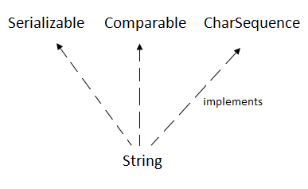
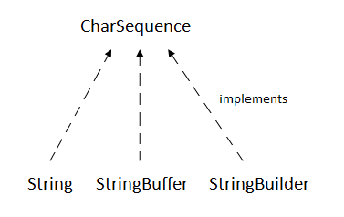

# String
Java String类提供了很多方法来对字符串执行操作，例如 compare(), concat(), equals(), split(), length(), replace(), compareTo(), intern(), substring() etc.<br>
string类实现了Serializable、Comparable和CharSequence接口。<br>
<br>
CharSequence接口用于表示字符序列。String、StringBuffer和StringBuilder类实现了它。这意味着，我们可以通过使用这三个类在Java中创建字符串。<br>
 <br>
Java字符串是不可变的，这意味着它不能被更改。每当我们更改任何字符串时，都会创建一个新实例。对于可变字符串，可以使用StringBuffer和StringBuilder类。<br> 

### 常用方法
**常用的：**
1. int length(): **长度**<br>
`"GeeksforGeeks".length();  // returns 13`
2. Char charAt(int i): **返回特定位置的char**<br>
`"GeeksforGeeks".charAt(3); // returns  ‘k’`
3. String substring (int i): **切割：从i到尾**<br>
`"GeeksforGeeks".substring(3); // returns “ksforGeeks”`
<br> String substring (int i, int j): **切割：从 i 到 j-1 index.**
`"GeeksforGeeks".substring(2, 5); // returns “eks”`
4. String concat( String str): **连接到另一个string尾部**<br>
 `String s1 = ”Geeks”;`<br>
    `String s2 = ”forGeeks”;`<br>
    `String output = s1.concat(s2); // returns “GeeksforGeeks”`
5. int indexOf (String s): **第一次出现语句s的位置**<br>
 `String s = ”Learn Share Learn”;`<br>
    `int output = s.indexOf(“Share”); // returns 6`
6. int indexOf (String s, int i): **从i开始第一次出现s的位置**<br>
 `String s = ”Learn Share Learn”;`<br>
    `int output = s.indexOf("ea",3);// returns 13`
7. Int lastIndexOf( String s):**最后一次出现s的位置**<br>
 `String s = ”Learn Share Learn”;`<br>
    `int output = s.lastIndexOf("a"); // returns 14`
8. boolean equals( Object otherObj):**是否相等**<br>
 `Boolean out = “Geeks”.equals(“Geeks”); // returns true`<br>
    `Boolean out = “Geeks”.equals(“geeks”); // returns false`
9. boolean  equalsIgnoreCase (String anotherString): **是否相等，不区分大小写.**<br>
 `Boolean out= “Geeks”.equalsIgnoreCase(“Geeks”); // returns true`<br>
    `Boolean out = “Geeks”.equalsIgnoreCase(“geeks”); // returns true`
10. int compareTo( String anotherString): **比较大小返回数字**<br>
`int out = s1.compareTo(s2);  // where s1 ans s2 are strings to be compared`
> This returns difference s1-s2. If :<br>
 out < 0  // s1 comes before s2<br>
 out = 0  // s1 and s2 are equal.<br>
 out > 0   // s1 comes after s2.<br>

11. int compareToIgnoreCase( String anotherString): **比较大小返回数字,忽略大小写**<br>
`int out = s1.compareToIgnoreCase(s2);// where s1 ans s2 are strings to be compared`
> This returns difference s1-s2. If :<br>
 out < 0  // s1 comes before s2<br>
 out = 0   // s1 and s2 are equal.<br>
 out > 0   // s1 comes after s2.<br>
Note- In this case, it will not consider case of a letter (it will ignore whether it is uppercase or lowercase).

12. String toLowerCase(): **全部转小写**<br>
    `String word1 = “HeLLo”;`<br>
    `String word3 = word1.toLowerCase(); // returns “hello"`

13. String toUpperCase(): **全部转大写**<br>
    `String word1 = “HeLLo”;`<br>
    `String word2 = word1.toUpperCase(); // returns “HELLO”`

14. String trim(): **复制，返回String的副本，删除两端的空白，它不会影响中间的空白。**<br>
    `String word1 = “ Learn Share Learn “;`<br>
    `String word2 = word1.trim(); // returns “Learn Share Learn”`

15. String replace (char oldChar, char newChar): **替换所由指定字符**<br>
    `String s1 = “feeksforfeeks“;`<br>
    `String s2 = “feeksforfeeks”.replace(‘f’ ,’g’); // returns “geeksgorgeeks”`<br>

16. boolean startsWith(String prefix , int toffset) 

    返回值：如果参数表示的字符序列是此对象从索引toffset处开始的子字符串，则返回true；否则返回false。如果toffset为负或大于此String对象的长度，则结果为false；否则结果与该表达式的结果相同。

    参数：prefix为指定的前缀。

    参数：toffset为在字符串中开始查找的位置。

    示例  本示例使用startsWith方法来判断前缀“I l”是否是字符串strCom1中开始索引位置是0的字符序列，并将结果赋值给boolean变量strB。由于字符串strCom1中开始索引位置在0的字符序列与指定的前缀“I l”相同，因此对象strB为true。

17. boolean startsWith(String prefix) 

    返回值：如果参数表示的字符序列是此字符串表示的字符序列的前缀，则返回true；否则返回false。如果参数是空字符串，或者等于此String对象（用equals(Object)方法确定），则返回true。

    参数：prefix为指定的前缀。
    


## StringBuffer
string表示固定长度、不可变的字符序列，而StringBuffer表示可增长和可写的字符序列。
### stringbuffer特点
* **线程安全**，可以在任何需要的地方同步，所有操作按照顺序发生。
* 当涉及源序列的操作发生时（such as appending or inserting）类**只在**执行操作的(string buffer)**缓冲区上同步**
* 它继承了Object类的一些方法，如 clone(), equals(), finalize(), getClass(), hashCode(), notifies(), notifyAll().
* 类的所有实现接口:Serializable, Appendable, CharSequence。
### 构造
1. StringBuffer(): 保留16个字符的空间而不重新分配.<br>
`StringBuffer s = new StringBuffer();`
2. StringBuffer( int size): 设置缓冲区大小的整数参数。<br>
`StringBuffer s = new StringBuffer(20);`
3. StringBuffer(String str): 它接受一个字符串初始内容，并在不重新分配的情况下为16个字符预留空间。
`StringBuffer s = new StringBuffer("GeeksforGeeks");`
### 方法
1. append()	insert()	指定的索引位置插入文本
2. delete()	从调用对象中删除一个字符序列
3. deleteCharAt()删除索引处字符
4. length()	字符串的长度
5. capacity() 总分配容量,the total allocated capacity
6. charAt(); void setCharAt(int index, char ch):
7. getChars(int srcBegin, int srcEnd, char[] dst, int dstBegin): void从该序列复制到目标字符数组dst中.
8. ensureCapacity()	确保容量至少等于给定的最小值
9. length()	Returns length of the string  
10. reverse()	Reverse the characters within a StringBuffer object
11. replace()	Replace one set of characters with another set inside a StringBuffer object

## StringBuilder
- StringBuilder类与StringBuffer类的区别在于同步。
- 在可能的情况下，**建议优先使用这个类**，而不是StringBuffer，因为在大多数实现中**它会更快**。
>java.lang.Object<br>
	↳ java.lang<br>
		↳ Class StringBuilder
### 构造
* StringBuilder(): Constructs a string builder with no characters in it and an initial capacity of **16 characters**.
* StringBuilder(int capacity): Constructs a string builder with no characters in it and **an initial capacity specified** by the capacity argument.
* StringBuilder(CharSequence seq): 
* StringBuilder(String str):


## 所有String方法
```
Method			Description			Return Type
charAt()		Returns the character at the specified index (position)	char
codePointAt()		Returns the Unicode of the character at the specified index	int
codePointBefore()	Returns the Unicode of the character before the specified index	int
codePointCount()	Returns the number of Unicode values found in a string.	int
compareTo()		Compares two strings lexicographically	int
compareToIgnoreCase()	Compares two strings lexicographically, ignoring case differences	int
concat()		Appends a string to the end of another string	String
contains()		Checks whether a string contains a sequence of characters	boolean
contentEquals()		Checks whether a string contains the exact same sequence of characters of the specified CharSequence or StringBuffer	boolean
copyValueOf()		Returns a String that represents the characters of the character array	String
endsWith()		Checks whether a string ends with the specified character(s)	boolean
equals()		Compares two strings. Returns true if the strings are equal, and false if not	boolean
equalsIgnoreCase()	Compares two strings, ignoring case considerations	boolean
format()		Returns a formatted string using the specified locale, format string, and arguments	String
getBytes()		Encodes this String into a sequence of bytes using the named charset, storing the result into a new byte array	byte[]
getChars()		Copies characters from a string to an array of chars	void
hashCode()		Returns the hash code of a string	int
indexOf()		Returns the position of the first found occurrence of specified characters in a string	int
intern()		Returns the canonical representation for the string object	String
isEmpty()		Checks whether a string is empty or not	boolean
lastIndexOf()		Returns the position of the last found occurrence of specified characters in a string	int
length()		Returns the length of a specified string	int
matches()		Searches a string for a match against a regular expression, and returns the matches	boolean
offsetByCodePoints()	Returns the index within this String that is offset from the given index by codePointOffset code points	int
regionMatches()		Tests if two string regions are equal	boolean
replace()		Searches a string for a specified value, and returns a new string where the specified values are replaced	String
replaceFirst()		Replaces the first occurrence of a substring that matches the given regular expression with the given replacement	String
replaceAll()		Replaces each substring of this string that matches the given regular expression with the given replacement	String
split()			Splits a string into an array of substrings	String[]
startsWith()		Checks whether a string starts with specified characters	boolean
subSequence()		Returns a new character sequence that is a subsequence of this sequence	CharSequence
substring()		Returns a new string which is the substring of a specified string	String
toCharArray()		Converts this string to a new character array	char[]
toLowerCase()		Converts a string to lower case letters	String
toString()		Returns the value of a String object	String
toUpperCase()		Converts a string to upper case letters	String
trim()			Removes whitespace from both ends of a string	String
valueOf()		Returns the string representation of the specified value	String
```
